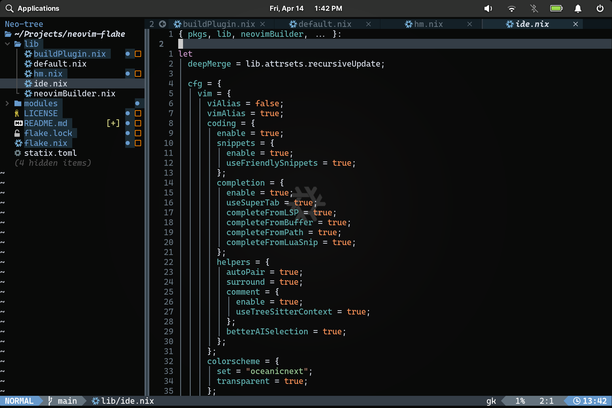

# neovim-flake

Nix flake for [neovim](https://neovim.io/) that closely follows the [LazyVim](https://www.lazyvim.org) configuration.

It is usable as a nixpkgs overlay, a home-manager module, or as a stand-alone nix flake.
This is a bit of an experiment as a personal project. I am unlikely to fix any issues, beyond ones that affect me personally.


## Documentation
### try it out
```
nix run github:cwfryer/neovim-flake .#default
```
By default, this includes all the LazyVim keybinds, autocmds, and settings.
It also includes LSP support for Lua, Nix, and Rust (via [rust-tools](https://github.com/simrat39/rust-tools.nvim)).
### nixpkgs overlay
This flake outputs an overlay that replaces the nix-community/neovim-nightly-overlay with this neovim package.
To use it in your flake config:
```
{
  inputs = {
    #... other inputs here...
    neovim-nightly = {
      url = "github:nix-community/neovim-nightly-overlay";
      inputs.nixpkgs.follows = "nixpkgs";
    };
    neovim-flake = {
        url = github:cwfryer/neovim-flake;
        inputs.nixpkgs.follows = "nixpkgs";
    };
  };
  outputs = {
    nixosConfigurations = {
      "<your_hostname"> = nixpkgs.lib.nixosSystem {
        nixpkgs = {
          overlays = [
            inputs.neovim-flake.overlays.default
            #... your other overlays ...
          ];
        };
        #... more nix config ...
        environment.systemPackages = with pkgs; [
          #... your packages ...
          neovim-nightly
        ];
      }
    };
  };
}
```
You can also overlay nixpkgs in your home-manager configuration. It works basically the same as above. But... you should just the home-manager module below.

### home-manager module (recommended)
The best option is to use the home-manager module.
Add the input flake:
```
{
  neovim-flake = {
    url = github:gvolpe/neovim-flake;
    inputs.nixpkgs.follows = "nixpkgs";
  };
}
```
Import the home-manager module:
```
{
  imports = [ neovim-flake.nixosModules."<your_system>".hm ];
}
```
Add the module to your home-manager config:
```
{
  programs.neovim-ide = {
    enable = true;
    settings = {
      #... your options ...
    };
  }
}
```
## Credits
Mostly based on Gabriel Volpe's [neovim-flake](https://github.com/gvolpe/neovim-flake).
Which was based on Jordan Isaacs' [neovim-flake](https://github.com/jordanisaacs/neovim-flake), which was based on Wil Taylor's [neovim-flake](https://github.com/wiltaylor/neovim-flake).

All 3 of these are great references to see how to use a flake to build your flavor of Neovim.
The vim configuration is largely based on the oustanding [LazyVim](https://www.lazyvim.org).
